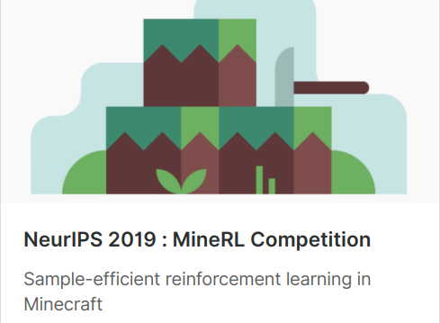

The code uploaded here is for MineRL Competition 2019. The purpose of the competition is to find an effective reinforcement learning algorithm using human play datasets. 

# How to train and test
The code required for traning and testing is created according to the competition submission form provided by AiCrowd. First, after downloading the code to git, use the requirement.txt file to install the package. After that, you need to run the train.py file, change the tensorflow weights file storage path and the name of the MineRL environment you are trying to train. They are trained using MineRLNavigate-v0, MineRLTreechop-v0 and MineRLObtainIronPickaxe-v0 datasets, respectively. In the test.py file, using the trained treechop and navigate techniques to produce a wooden pickaxe, this is where the stone is collected.

# Introduction
I started participating at the beginning of this competition, but I wasn't able to participate correctly in the Retro Contest held at OpenAI last year, so I wanted to finish it this time. What is required in the competition is a method for efficiently learning a reinforcement learning model using given data. For these reasons, we approached the most basic network by using supervised learning and learning according to a given data set.

# MineRL environment
MineRL is a python platform for Artificial Intelligence research based on Minecraft. The platform is based on the Malmö created by Microsoft, which is the basic environment, and various data directly played by large-capacity people are added here. 

I'm interested in the platform because I like to play and watch Minecraft directly. In the process of learning the agent, you can play directly to confirm the process that you do not know well, or watch various other people's play through the location of the update.

Requesting in the competition is to resolve MineRLObtainDiamond-v0. In order to solve this, advance work such as moving to a specific place or collecting wood is necessary.

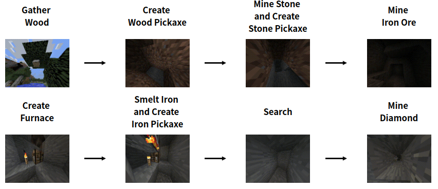

The agent obtains information on items currently possessed, including screen information on the screen during game play. In addition, actions such as camera rotation, advancement, attack, item creation, item drop, and item equipment can be performed.

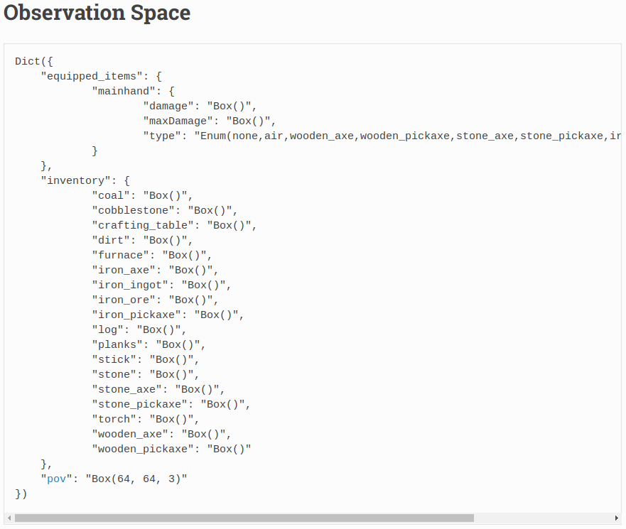 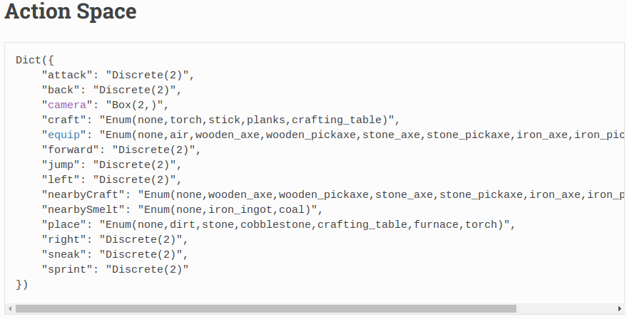

## How to use human play dataset
Since it is efficient reinforcement learning using game play data of the target person of the competition, a large capacity play data set is given. Rather than learning everything from the beginning in Reinforcement Learning, using this data to let the network learn in advance is a faster way to get diamonds. 

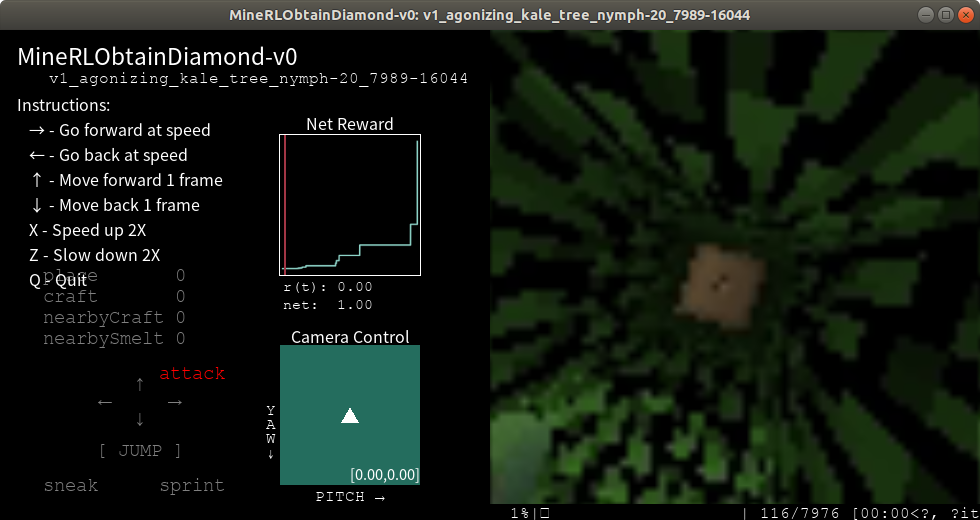

Fortunately, in addition to providing a data set from the organizer, it also provides a viewer in the form of a GUI, so that for the first time like Minecraft, participants can easily understand the goals of the game. In particular, it is possible to check not only the screen but also the behavior of the agent and the change in the compensation value associated therewith in units of frames.

## Network Structure
The network structure is largely composed of a CNN part that receives the current state value of the agent and an FC part that outputs the next action value.

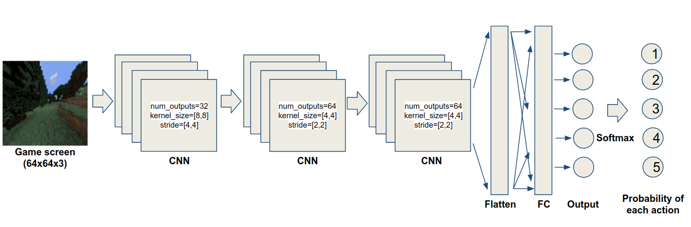

Minecraft does not allow you to see all game information at once. Therefore, it can be predicted that the behavior in the current frame is affected by the information in the previous frame. Therefore, we could use the RNN network additionally to account for these temporal depencies and see better performance in the Treechop task.


It is necessary to select the action of the agent by the value output from the network. In the first output, an action related to an item is selected, and in the second output, an attack, jump, and camera rotation action are selected. The details of the contents mentioned pevious can be confirmed with the uploaded code.

## Preprosseing
The agent obtains information on items currently possessed, including screen information on the screen during game play. In addition, actions such as camera rotation, advancement, attack, item creation, item drop, and item equipment can be performed. In the case of screen information, since it is image information, it is divided into 255 before learning and changed to a value between 0 and 1, and in the case of inventory information, it is divided into 2304, the upper limit of item possession.

Also, there are very many cases where all actions are 0 in the provided data set. When traning without deleting this data, there are many cases where the agent is continuously stopped at the same place. These data were deleted before learning.

## Treechop Imitation Learning with only frame information
After completing the traning, the agent can approach to the two trees in the environment and attack it to collect the woods. However, it stops. Therefore, the agent cannot collect more wood.


Loss graph shows that there is no ploblem in traning process. However, in the model that used only the test results CNN and FC many times, we finally concluded that there was a limit to learning.
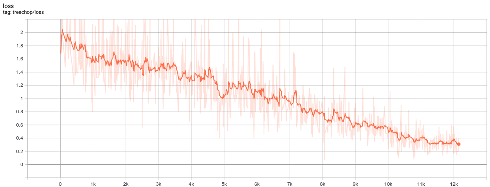

Because of the nature of the Minecraft, I think that it would not be possible to fit all the information on one screen. Thus, I deploy RNN and insert it between CNN and FC layer.

Performance video after adding RNN : https://youtu.be/5bMTUvPmCuQ

## IronPickaxe Imitation Learning with inventory and frame information
In all environments except Navigate and Treechop environment, in addition to the video image information on the screen, agent can also check the information of the items you currently have. If you can find a network that can take this information and act accordingly, it is more efficient than manually creating all such procedures.


In particular, when installing a Crafting Table, Furnace, or Torch, it is necessary to use the Screen information together, so these functions can be considered very convenient. For the MineRLObtainIronPickaxe-v0 dataset, traning is performed by adding Inventory information to the Screen information of the existing network of previous section.

<p>
    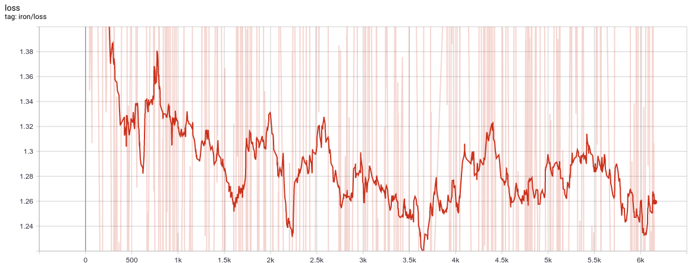
</p>
<p>
    <em>Without Inventory infomation normalization</em>
</p>

~As a result of trarning, unlike the result before using only the Screen information, the loss graph do not decrease, and it is confirmed that it goes up and down periodically. It doesn't seem to be able to solve the problem that way, as the loss doesn't drop over time~

<p>
    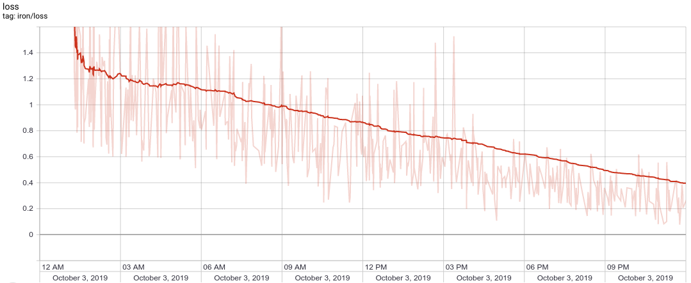
</p>
<p>
    <em>With Inventory infomation normalization</em>
</p>

I find a very big mistake while checking the baselines code that Minerllab uploaded. I do not normalize the Inventory information and combined it with the frame information, but when I correct mistake and re-trained and am able to confirm that the loss graph dropped well.

Performance video after training : https://youtu.be/ibJc8X7TXhM

When learning with this method, compared to other methods, learning was much more difficult, and even if loss was less than 0.1, it was confirmed that the agent did not move. In the same network structure, we decided that it would not be good to proceed in that way and decided to consider using Inventory information only in certain situations.

## How to record video of agent
Provide a method to save the agent's play figure learned with MineRL as an avi video file. First, download the env_wrappers.py (https://github.com/minerllabs/baselines/blob/master/general/chainerrl/baselines/env_wrappers.py) file together with the test.py file. After doing this, import ContinuingTimeLimitMonitor function and wrap env with that. Saving path should be declared.

```
env = ContinuingTimeLimitMonitor(env, root_path + 'monitor', mode='evaluation', 
                                 video_callable=lambda episode_id: True, force=True)
```

## Making item
To mine a stone, we need a Wooden Pickaxe which can be maded by three Planks, two Sticks, and a Crafting Table. 

 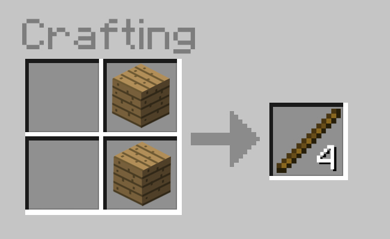

We were able to train the network by extracting only a part of a making specific item in the provided dataset. However, because the learning result was not as good as Treechop, we decided to use rule base method here. 

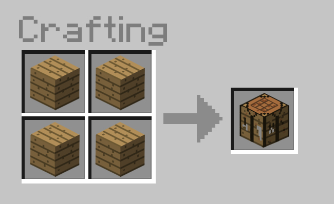 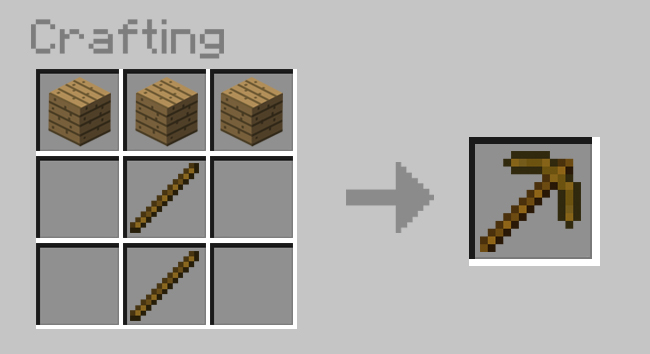

All three materials can basically be made in log, so the need to collect wood well through the tree chop task can proceed to the next task. In other words, only the treechop task is executed until 5 or more logs are collected, and then the action to create the required number of planks, sticks, and crafting_table is set directly using the if statement. The detail code can be found in the uploaded file.

## Debeg movement of the agent until making Wooden Pickaxe
When evaluating trained agents, we can not see a item in Inventory at Screen. Thus, we should use a print function.


## How to equip a Wooden Pickaxe
There are some minor bugs in the MineRL package. It is necessary to use a different method insteade of method in manual when equipting a Wooden Pickaxe. An action ['equip'] = 3 command must be changed to action ['equip'] = 'wooden_pickaxe'.

## Combine various tasks into one 
In order to solve the MineRL ObtainIronPickaxe-v0 environment, solving a simple environment is needed at first. Especially in the case of the competition, since the starting position is random, the agent can be activated first in an area where there are no trees around. In this case, we need to move to the area where the tree is, instead of trying to do the treechop task right away.

Performance video after combining task : https://www.youtube.com/watch?v=IDKemeU_laY

Once agent start the game, it will move for a certain amount of time, as you learned in the MineRLNavigate-v0 environment to walk around a specific place on the map. After that, act as learned in the MineRLTreechop-v0 environment. If there is no increase in the reward over a certain time, the two tasks are used repeatedly by searching around again.

## Pretrained model weights file
In addition to code sharing, Tensorflow weights file that is trained from Imitation Learning is shared.

Navigate : https://drive.google.com/drive/folders/17vVjFu0P1gd6rXRFSwfze5gvgutApemo?usp=sharing

TreeChop : https://drive.google.com/drive/folders/1pIBxe5G0x_NU85S3wxYUDDhhHNlSRArQ?usp=sharing

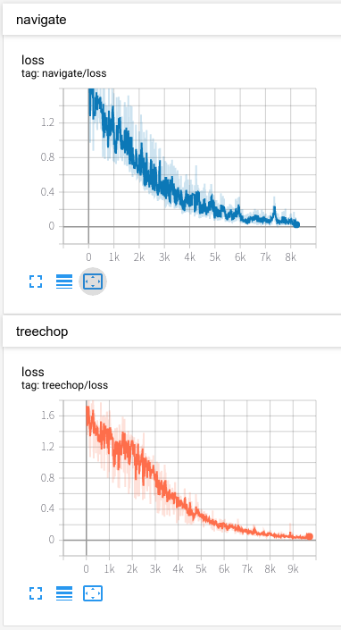

StoneMine : https://drive.google.com/drive/folders/1fs8AvnS8zNbjMgusE7aQxChkgBoWdQKE?usp=sharing
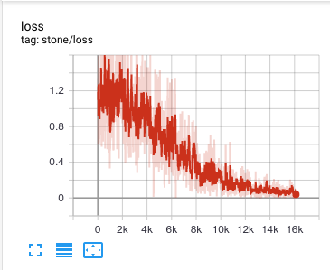

## Current Result
As a result of analyzing the behavior of agents trained so far, it is confirmed that the selection time interval between Navigate and Treechop task is an important factor. Also, if agent is sometimes trapped in the ground alone until the end of the episode, or if agent switch a task to a Treechop when run on the water using Navigate, we are able to detect death often. Even when Mob appear at night, there are cases where agent dies. we don't consider all these factors yet, so finding the tree immediately and finding the wooden pickaxe seems to be the best action we can do now.

 

This is the first half of the best-functioning episode of the agent to date, but if there are immediate trees around it, you can see that the collection will start soon. And when you finish collecting trees, you can see that it makes you feel comfortable moving to another tree.


The second half of the video is the part of making Wooden Pickaxe after collecting enough log, but you can not see all these kind of process because Inventory information is not visible. However, you can see a agent placing Crafting Table that is made from Stick, Planks.

```
inventory: {'coal': 0, 'cobblestone': 37, 'crafting_table': 0, 'dirt': 5, 'furnace': 0, 'iron_axe': 0, 'iron_ingot': 0, 'iron_ore': 0, 'iron_pickaxe': 0, 'log': 0, 'planks': 1, 'stick': 6, 'stone': 10, 'stone_axe': 0, 'stone_pickaxe': 0, 'torch': 0, 'wooden_axe': 0, 'wooden_pickaxe': 1}
equip_type: wooden_pickaxe
Total reward:  37.0
```
Eventually, looking at the items acquired by the agent, we can see that Cobblestones and Stones are collected correctly.

## Future Work
As you can see, when you dig underground to collect stones, the surroundings become very dark. In such a case, the surrounding area cannot be grasped, so the torch must be used to clarify the surrounding area.

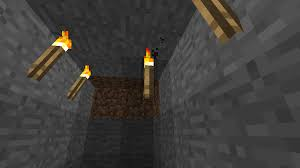 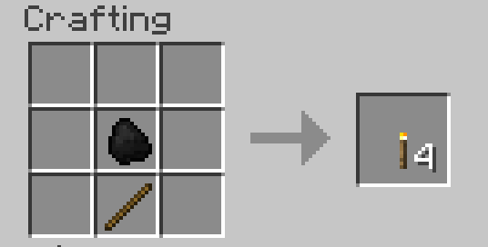
