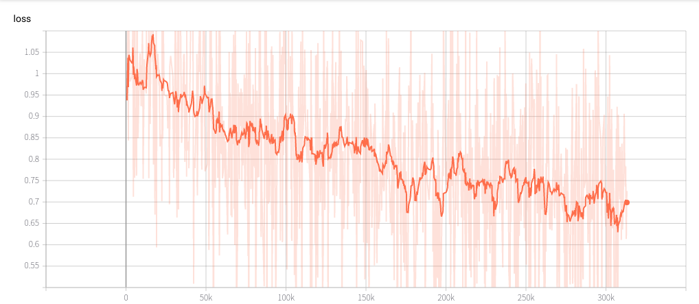
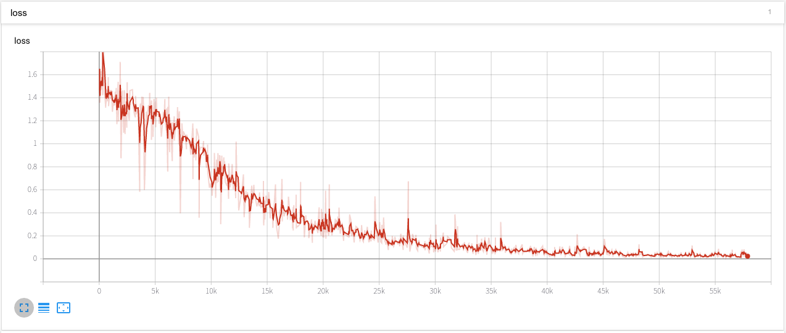

The code uploaded here is for MineRL Competition 2019. The purpose of the competition is to find an effective reinforcement learning algorithm using human play datasets. 

# Introduction
I started participating at the beginning of this competition, but I wasn't able to participate correctly in the Retro Contest held at OpenAI last year, so I wanted to finish it this time. What is required in the competition is a method for efficiently learning a reinforcement learning model using given data. For these reasons, we approached the most basic network by using supervised learning and learning according to a given data set.

# MineRL environment
Requesting in the competition is to resolve MineRLObtainDiamond-v0. In order to solve this, advance work such as moving to a specific place or collecting trees is necessary.

The agent obtains information on items currently possessed, including screen information on the screen during game play. In addition, actions such as camera rotation, advancement, attack, item creation, item drop, and item equipment can be performed.

 

## Network Structure
The network structure is largely composed of a CNN part that receives the current state value of the agent and an FC part that outputs the next action value.

Minecraft does not allow you to see all game information at once. Therefore, it can be predicted that the behavior in the current frame is affected by the information in the previous frame. Therefore, we could use the RNN network additionally to account for these temporal depencies and see better performance in the Treechop task.

# Preprosseing
The agent obtains information on items currently possessed, including screen information on the screen during game play. In addition, actions such as camera rotation, advancement, attack, item creation, item drop, and item equipment can be performed. Moreover, it is necessary to select the action of the agent by the value output from the network. In the first output, an action related to an item is selected, and in the second output, an attack, jump, and camera rotation action are selected. The details of the contents mentioned pevious can be confirmed with the uploaded code.

## Imitation Learning Result
After completing the learning, the agent can go to the two trees in the environment and attack it to collect the woods. However, it stops. Therefore, the agent cannot collect more wood.

Loss graph shows that there is no ploblem in traning process. However, in the model that used only the test results CNN and FC many times, we finally concluded that there was a limit to learning.

Because of the nature of the game, I thought that it would not be possible to fit all the information on one screen, so I introduced RNN and added it between CNN and FC for learning.

Performance video after adding RNN : https://youtu.be/5bMTUvPmCuQ

## Making item task
We were able to train the network by extracting only a part of a specific item in the provided data set. However, because the learning result was not as good as Treechop, we decided to use Rule base here.
