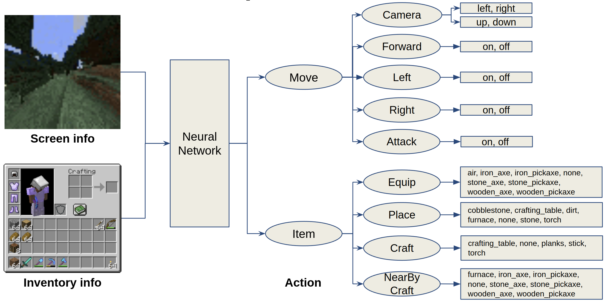
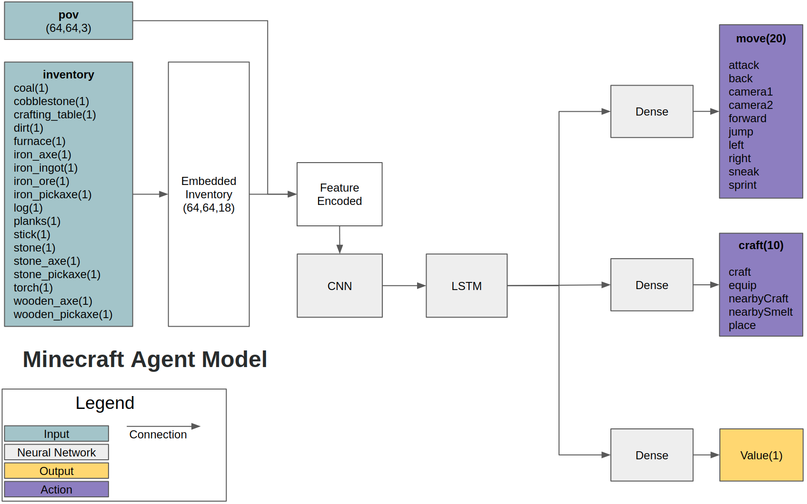
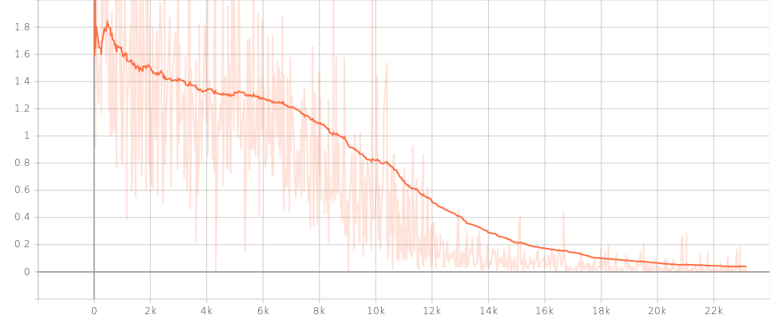
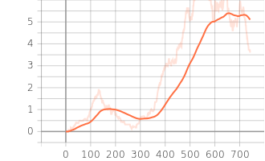

# Introduction
Code for playing the Minecraft using the Deep Learning. 

# Python Dependencies
1. Minerl
2. Tensorflow 2.4.1
3. Tensorflow_probability 0.11.0
4. ZeroMQ
5. Gym
6. OpenCV
7. Matplotlib

# Action, Observation of Minecraft

# Network architecture

# Supervised Learning method
For Minecraft games, agent can not learn every behaviour for high level playing only using Reinforcment Learning becaue of complexity of task. In such cases, the agent must first learn through human expert data. Let's try this for MineRLTreechop-v0 first using below Notebook.

[Supervised Learning for MineRL](https://github.com/kimbring2/minecraft_ai/blob/master/MineRL-TreeChop(LSTM).ipynb)

Cross enthropy is used for calculating loss between action of human expertand agent network. Loss should fall to almost 0 as shown in the graph below.

# Reinforcement Learning method
Because of long game play time, normal A2C method can not be used because it should use whole episode once. Therefore, off-policy A2C such as [IMPALA](https://deepmind.com/research/publications/2019/impala-scalable-distributed-deep-rl-importance-weighted-actor-learner-architectures) is needed. It can restore trajectory data from buffer for training like a DQN.

You can run the IMPALA for MineRL by below command. 

$ ./run.sh [number of envs]

$ ./run.sh 1

In the simplest task like a MineRLNavigateDense-v0, agent can find a direction very easily like a below graph when using only 3 action.

# How to run 
First, you need to check everything about MineRL package works well in your PC. Please visit https://minerl.readthedocs.io/en/latest/.

If everything is fine, open and run the cell of MineRL-TreeChop(LSTM).ipynb file. It is simple A2C agent for TreeChop task of Minecraft. Firat, agent is trained via Supervised Learning. Next, it begins Reinforcement Learning phase from pretrained model.

# Detailed inforamtion
Please check Medium article(https://medium.com/@dohyeongkim/deep-q-learning-from-demonstrations-dqfd-for-minecraft-tutorial-1-4b462a18de5a) for more information.
