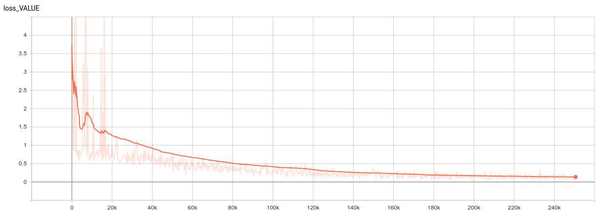

# Introduction
I am reproducing content of paper(https://arxiv.org/pdf/1912.08664v2.pdf) of winner of first Minecraft Reinforcement Learning challenge of NeurIPS 2019.

# Reference
1. https://github.com/AurelianTactics/dqfd-with-keras : I mainly use preprocessig code of that repo and change Keras based code to to Tensorflow
2. https://github.com/go2sea/DQfD : DQDF of that repo code is clean and good for knowing main idea of algorithm.
3. https://medium.com/emergent-future/simple-reinforcement-learning-with-tensorflow-part-6-partial-observability-and-deep-recurrent-q-68463e9aeefc : I use a Deep Recurrent Q-Networks of Arthur Juliani.

# How to run 
1. Simple DQN code for Navigation task : Open and run MineRL_Navigate_DQN.ipynb file.
2. Basic DQFQ code for Treechop task : Run dqfd_treechop.py file.
3. Add RNN and left,right action code for Treechop task : Run drqfd_treechop.py file. 

# How to check training goes well
1. Loss check : Loss should fall to almost 0 as shown in the graph above when the DQFD network is trained by the Supervised Learning manner.

# Dependencies
1. MineRL : pip install minerl
2. Tensorflow : pip install tensorflow-gpu==1.13.1

# Detailed inforamtion
Please check Medium article(https://medium.com/@dohyeongkim/deep-q-learning-from-demonstrations-dqfd-for-minecraft-tutorial-1-4b462a18de5a) for more information.
