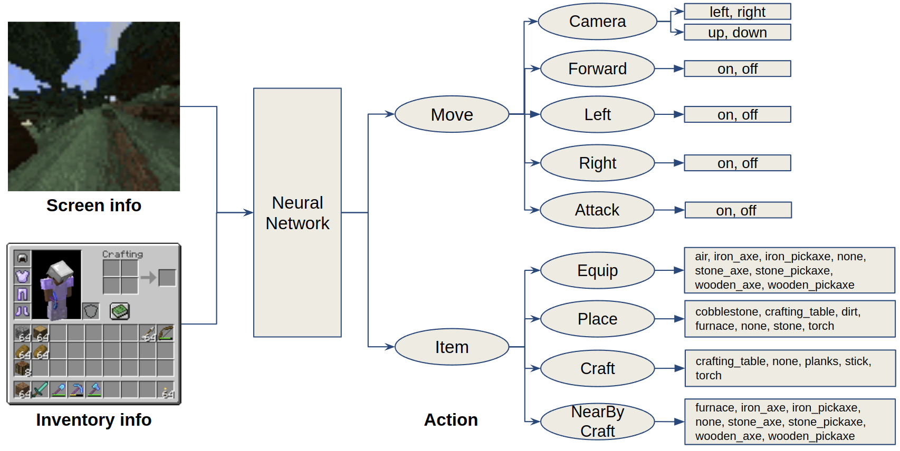
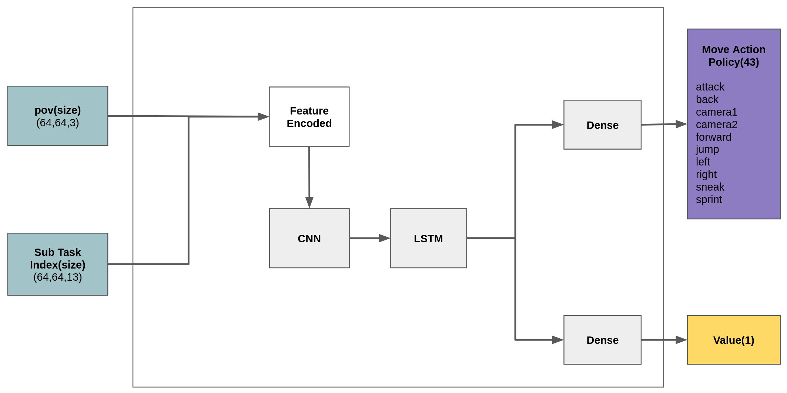
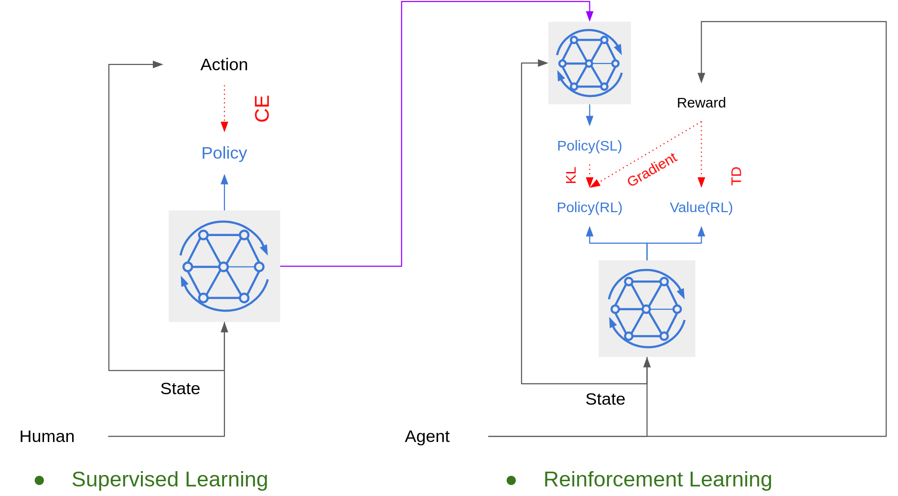
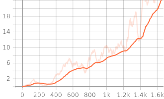

# Introduction
Code for playing the Minecraft using the Deep Learning. 

# Normal Dependencies
1. Ubuntu
2. Tmux

# Python Dependencies
1. Minerl 0.3.7
2. Tensorflow 2.4.1
3. Tensorflow_probability 0.11.0
4. ZeroMQ
5. Gym
6. OpenCV
7. Matplotlib

# Reference
1. [Hierarchical Deep Q-Network from Imperfect Demonstrations in Minecraft, A Skrynnik, 2019](https://arxiv.org/abs/1912.08664)
2. [Sample Efficient Reinforcement Learning through Learning From Demonstrations in Minecraft, C Scheller, 2020](https://arxiv.org/abs/2003.06066)

# Action, Observation of Minecraft


# Model Architecture
## Learning-Based Model Architecture


## Rule-Based Model Architecture


# Loss for Training


# Training Method


# Run Supervised Learning
For Minecraft games, agent can not learn every behaviour for high level playing only using Reinforcment Learning becaue of complexity of task. In such cases, the agent must first learn through human expert data. Try to train network for MineRLTreechop-v0 first using below command.

```
$ python run_supervised_learning.py --workspace_path [your path]/minecraft_ai/ --data_path [your path]/minerl_data/ --gpu_use True
```

The loss should fall to near 0 as shown like below graph. Model is saved under folder named model of workspace path.


You can download the [weight of trained SL model](https://drive.google.com/drive/folders/17TbZoLhvLw0VZGoj3w97fTWdKq1TDs0d?usp=sharing) from Google Drive. Try to use 'tree_supervised_model_15800' file.

After finishing training, you can test trained model using below command.

```
$ python run_evaluation.py --workspace_path [your path]/minecraft_ai/ --model_name [trained model name] --gpu_use True
```

# Run Reinforcement Learning
Because of long game play time, normal A2C method can not be used because it should use whole episode once. Therefore, off-policy A2C such as [IMPALA](https://deepmind.com/research/publications/2019/impala-scalable-distributed-deep-rl-importance-weighted-actor-learner-architectures) is needed. It can restore trajectory data from buffer for training like a DQN.

You can run the IMPALA with Supervised model for MineRL by below command.

```
$ ./run_reinforcement_learning.sh [number of envs] [gpu use] [pretrained model]
```

You can ignore below error of learner.py part. It does not effect the training process.

```
Traceback (most recent call last):
File "C:/minerl/learner.py", line 392, in
coord.join(thread_data)
File "C:\Users\sund0\anaconda3\envs\minerl_env\lib\site-packages\tensorflow\python\training\coordinator.py", line 357, in join
threads = self._registered_threads.union(set(threads))

where line 391 and 392 is
for thread_data in thread_data_list:
coord.join(thread_data)
```

After some training, the agent starts to collect tree and earn rewards as shown in the graph below.



You can download the [weight of trained RL model](https://drive.google.com/drive/folders/1VR5FPcmIeNVw56cBPDjTmMt9YJHLIel6?usp=sharing) from Google Drive. Try to use 'tree_reinforcement_model_128000' file.

Below video is evluation result of trained agent.

[](https://youtu.be/SwqSuTBwT0A)

# Detailed inforamtion
1. Prepare Model: https://medium.com/@dohyeongkim/deep-q-learning-from-demonstrations-dqfd-for-minecraft-tutorial-1-4b462a18de5a
2. Training Model: https://dohyeongkim.medium.com/how-to-build-the-deep-learning-agent-for-minecraft-with-code-tutorial-2-e5ddbf80eca1
