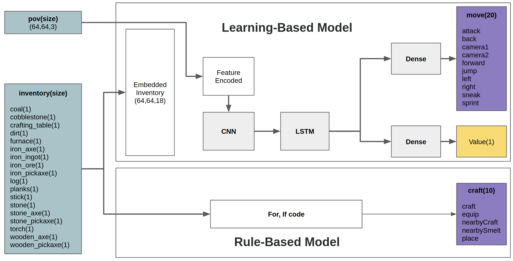

# Introduction
Code for playing the Minecraft using the Deep Learning 

# Dependencies
1. minerl
2. tensorflow 2

# Network architecture

# Reference
1. 

# How to run 
1. Actor-Critic based agent for TreeChop task: Open and run MineRL-TreeChop(LSTM).ipynb file

# How to check training goes well
1. Loss check : Loss should fall to almost 0 as shown in the graph above when the policy network is trained by the Supervised Learning manner.

# Detailed inforamtion
Please check Medium article(https://medium.com/@dohyeongkim/deep-q-learning-from-demonstrations-dqfd-for-minecraft-tutorial-1-4b462a18de5a) for more information.
