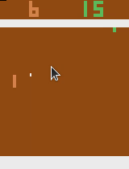

# Requirement
1. Tensorflow 2.4.1
2. TensorFlow Probability 0.11.0
3. tmux

# Reference
1. Seed RL: https://github.com/google-research/seed_rl

# Usage
$ python3.7 learner.py --env_number 10 --workspace_path /home/[Your User Name]/pong_impala

# Training Result

```
reward_sum: 12.0
reward_sum: 12.0
reward_sum: 12.0
reward_sum: 13.0
reward_sum: 6.0
reward_sum: 10.0
reward_sum: 6.0
reward_sum: 10.0
reward_sum: 9.0
reward_sum: 14.0
reward_sum: 11.0
reward_sum: 4.0
reward_sum: 4.0
reward_sum: 10.0
reward_sum: 12.0
reward_sum: 8.0
reward_sum: 7.0
reward_sum: 10.0
reward_sum: 10.0
reward_sum: 15.0
reward_sum: 12.0
reward_sum: 14.0
reward_sum: 16.0
```


  
